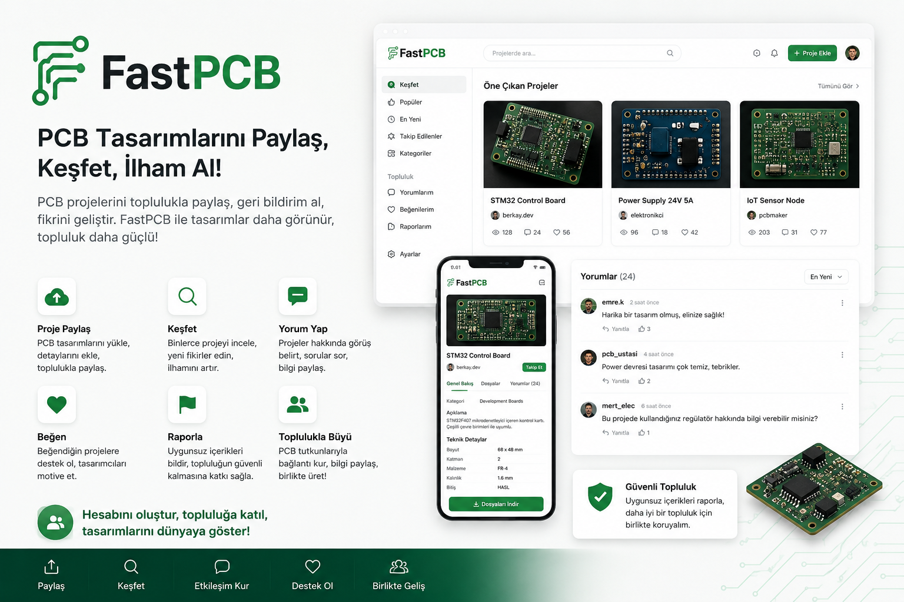

# FastPCB

---

## Proje Hakkinda

**Proje Tanimi:**
> FastPCB, kullanicilarin PCB tasarimlarini yukleyip toplulukla paylastigi bir platformdur. Sistem uzerinden kullanicilar hesap olusturabilir, proje ekleyebilir, teknik detay girebilir, tasarim dosyalarini yukleyebilir, diger projeleri kesfedebilir, yorum yapabilir, begeni birakabilir ve uygunsuz icerikleri raporlayabilir. Projenin amaci PCB toplulugu icin sade, anlasilir ve etkilesimli bir paylasim ortami sunmaktir.

**Proje Kategorisi:**
> Sosyal Medya / Teknik Icerik Paylasim Platformu

**Referans Uygulama:**
> [Hackaday.io](https://hackaday.io/)

---

## Proje Linkleri

- **REST API Adresi:** `http://localhost:5000/swagger`
- **Web Frontend Adresi:** `http://localhost:5173`

---

## Proje Ekibi

**Grup Adi:**
> FastPCB

**Ekip Uyeleri:**
- Yusuf Doruatli

---

## Dokumantasyon

Proje dokumantasyonuna asagidaki linklerden erisebilirsiniz:

1. [Gereksinim Analizi](Gereksinim-Analizi.md)
2. [REST API Tasarimi](API-Tasarimi.md)
3. [REST API](Rest-API.md)
4. [Web Front-End](WebFrontEnd.md)
5. [Mobil Front-End](MobilFrontEnd.md)
6. [Mobil Backend](MobilBackEnd.md)
7. [Video Sunum](Sunum.md)

---

## Notlar

- Backend `.NET 8 Web API`, frontend ise `React + Vite + TypeScript` ile gelistirilmistir.
- Veritabani olarak `MySQL` kullanilmaktadir.
- Kimlik dogrulama `JWT` ile saglanmaktadir.
- Proje artik siparis ve odeme mantiginda degil, PCB paylasim platformu mantiginda ilerlemektedir.
